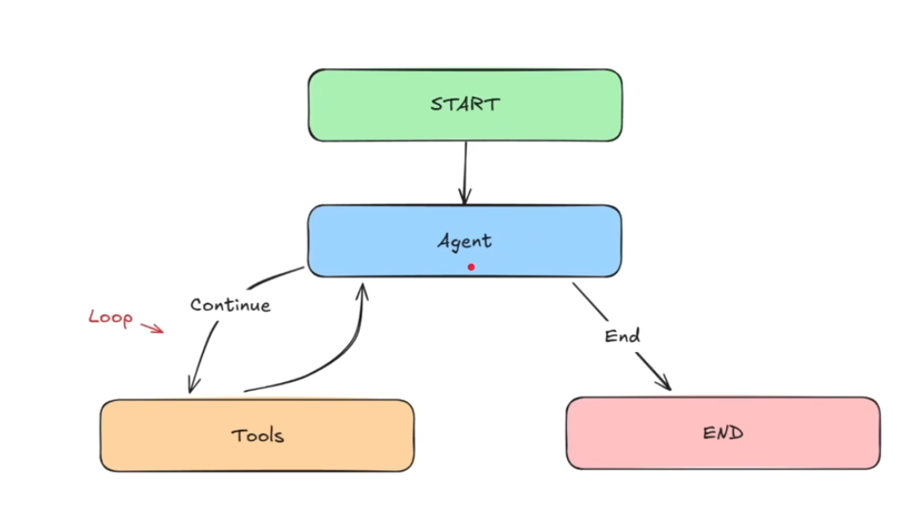

## How to run postgress
    > brew services start postgresql
    brew services start postgresql@14
    psql --version
    postgres pwd : Testing@123 (super user)
    [text](../../../../opt/homebrew/lib/python3.13.3/site-packages)
    [text](../../../../opt/homebrew)

## AI/ML 

   Backend --- Fast API to build the api(done)
   LangGraph ----  orchestrate the AI agentc(done)
   Groq ---- for fast and free LLM inference
   Jina ----  AI for embeddings
   postgres sql for PGVector our database and vector search
   vercel --- we can host it for free

    Infra: AWS free tier ($200 credits)
    DevOps: OpenTofu, CircleCI / GitHub Actions, GitHub, Docker
    Quality: Sentry, Opik, CloudWatch, Ruff, MyPy

    

    
    
    

    # React agent screenshot
    

## open api. key
echo 'export AZURE_OPENAI_API_KEY="api_key"' >> ~/.zshrc
source ~/.zshrc

 https://platform.openai.com/
 https://platform.openai.com/api-keys

 Then use:
    n (next)
    s (step in)
    p variable_name
    c (continue)