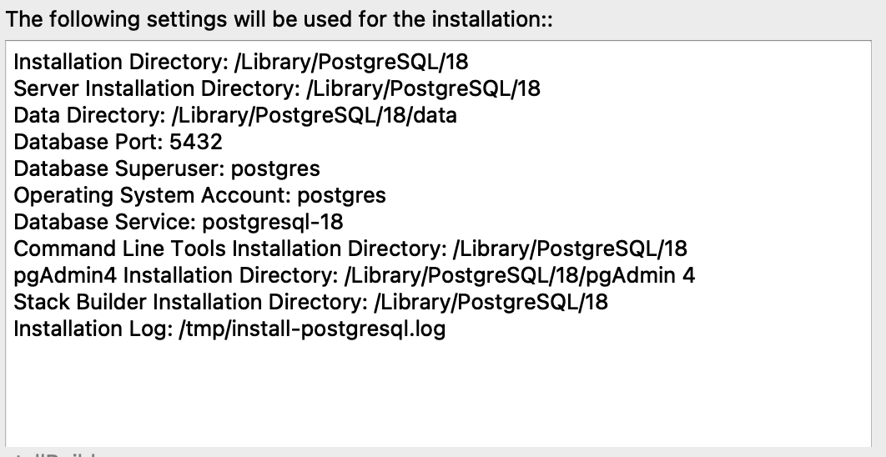
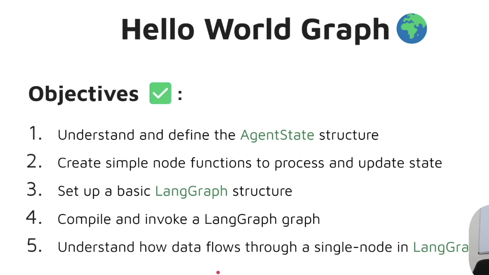
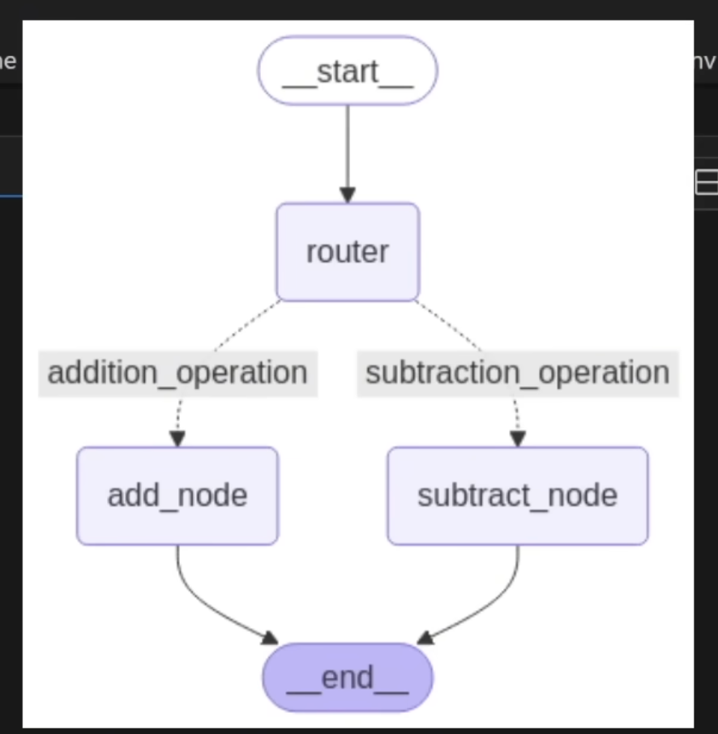

# AIwithAshish

## Project Description

AIwithAshish is an intelligent agent orchestration platform that leverages advanced AI/ML technologies to build and deploy sophisticated multi-agent systems. The project combines LangGraph for workflow orchestration, FastAPI for backend services, and cutting-edge LLM inference to create intelligent agents capable of complex decision-making and task execution.

This platform supports multiple agent types including a React agent, a drafter agent, and custom Azure OpenAI-powered agents. It enables conditional routing, looping workflows, and multi-route graph execution for flexible and powerful agent behavior. The system is designed to scale efficiently using cloud infrastructure and is production-ready with comprehensive quality assurance tools.

**Key Features:**
- Multi-agent orchestration with LangGraph
- Conditional workflow graphs
- Looping workflow graphs
- Multi-route workflow graphs
- React agent implementation
- Drafter agent implementation
- Azure OpenAI integration

## Tech Stack

### AI/ML

| Component   | Technology                                          |
|-------------|-----------------------------------------------------|
| Backend     | FastAPI                                             |
| Orchestration | LangGraph — orchestrate the AI agents             |
| Inference   | Groq — fast and free LLM inference                 |
| Embeddings  | Jina AI                                             |
| Database    | PostgreSQL with PGVector for vector search          |
| Hosting     | Vercel (free tier)                                  |

### Infrastructure & DevOps

| Area    | Tools                                               |
|---------|-----------------------------------------------------|
| Infra   | AWS free tier ($200 credits)                        |
| DevOps  | OpenTofu, CircleCI / GitHub Actions, GitHub, Docker |
| Quality | Sentry, Opik, CloudWatch, Ruff, MyPy                |

## Screenshots







### React Agent


## Setup

### PostgreSQL

```bash
brew services start postgresql@14
psql --version
```

### Azure OpenAI API Key

```bash
echo 'export AZURE_OPENAI_API_KEY="api_key"' >> ~/.zshrc
source ~/.zshrc
```

- Dashboard: https://platform.openai.com/
- API Keys: https://platform.openai.com/api-keys

## Debugging

```
n            # next
s            # step in
p <variable> # print variable
c            # continue
```